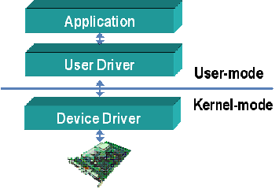

# Developping-Linux-Device-Drivers
# First implementation of Linux Device Driver  and yet others are coming 

 * A device driver is a particular form of software application that allows one hardware device to interact with an other hardware device
 * Device drivers are just abstratctions to a piece of hardware 
  
 * Drivers act as a bridge between hardware and a user application 
  
 * In linux, drivers are implemented in 2 ways:
    1. Drivers can be compiled as part of the kernel 
    2. Drivers can be compiled as modules and located at runtime   
   

## How Device Drivers Work


A device driver usually communicates with the hardware by means of the communications subsystem (the computer bus) to which the hardware is connected. It is essential that a computer have the correct device drivers for all its parts to keep the system running efficiently. When first turning on a computer, the OS works with device drivers and the basic input/output system (BIOS) to perform hardware tasks. Without a device driver, the OS would not be able to communicate with the I/O device.


## Global View of Linux Device Driver 


<p align="center">
  
</p>


## Let us start with a simple hello world kernel module. Here is the source code for a simple hello world kernel module.

```c
#include <linux/module.h>
#include<linux/init.h>
#include<linux/kernel.h>

static int hello_init(void){
printk("Hello, From the device driver hhhh \n");
return 0;
}


static void hello_exit (void){
printk("Good bye, see you next time with further Device Drivers  \n");
}

module_init(hello_init);
module_exit(hello_exit);


MODULE_AUTHOR ("Samar ");
MODULE_LICENSE("GPL");
MODULE_DESCRIPTION(" First hello world linux device driver");

```

1. Create a folder named Hello and then place **hello_world.c** and **Makefile** within it.
2. Open your terminal application and change directory to Hello.
3. Run the command **make** and if it successful! then it should generate loadable kernel module called **hello_world.ko** 
4. Now you have to test the module loading it to the kernel.For loading and unloading  kernel modules you need to have superuser permissions.Use the following command to load the kernel module into the kernel.

    ``
   $ sudo insmod hello_world.ko
    ``

## To see printed messages try it with:
``
$ dmesg
``

 if you encountered this log message: **hello_world: loading out-of-tree module taints kernel** don't panic because it indicates that the "hello_world" module you are loading is considered an "out-of-tree" module. **In the Linux kernel, out-of-tree modules are those that are not part of the main kernel source tree and are typically provided by third-party sources**.

### Loading an out-of-tree module taints the kernel, which means that it marks the kernel as potentially being in an "unstable" state. This is done as a precaution because out-of-tree modules may not have undergone the same level of testing and quality control as the mainline kernel modules.

### The taint message itself is informational and does not necessarily indicate an error or problem with the module. However, it's important to be aware that running with tainted kernel status may affect certain functionalities or support options.

### If the "hello_world" module is your own module or a module you obtained from a trusted source, you can continue using it without issues. However, if you are experiencing any problems or unexpected behavior, it's recommended to verify the source and compatibility of the module with your kernel version.

### It's worth noting that using out-of-tree modules may require extra caution and attention to ensure compatibility, stability, and security with your system. It's generally advised to use modules that are part of the main kernel tree whenever possible, as they have undergone more extensive testing and are better integrated with the kernel.

## To list module: 
``
$ lsmod | grep hello_world
``

## To remove Module:
``
$ sudo rmmod hello_world 
``